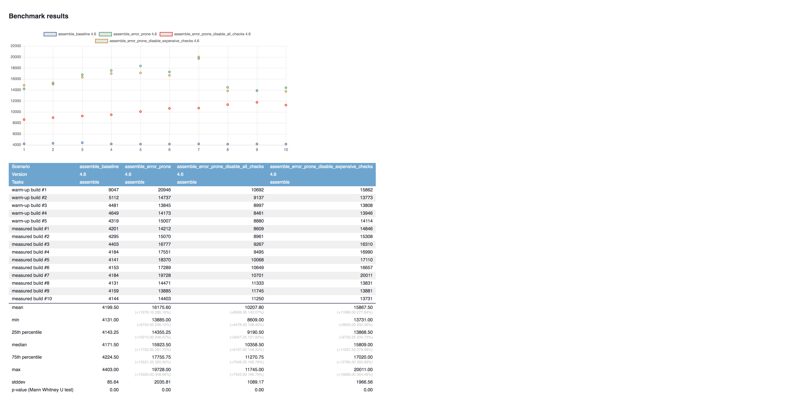
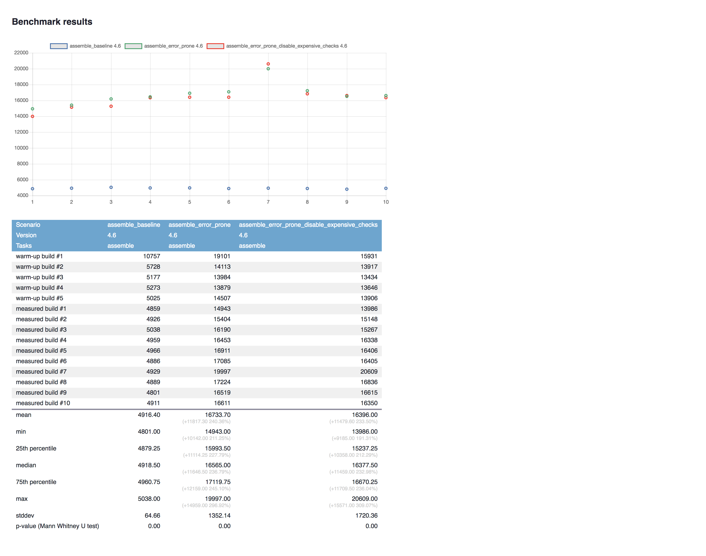

# Error Prone performance measurement project

Current test subject is [RxJava](https://github.com/ReactiveX/RxJava) 2.x project (Apache 2.0)

I integrate [Error Prone](https://github.com/google/error-prone) with RxJava and provide ways to benchmark and profile builds with Error Prone, with slightly optimized Error Prone configuration and without Error Prone.

Table of contents:

- [Findings](#findings)
    - [Numbers](#numbers)
    - []
- [Project Structure](#project-structure)
- [How to reproduce results on your end](#how-to-reproduce-results-on-your-end)
- [Why this project exists](#why-this-project-exists)
- [References](#references)
- [Docker WTH (Bonus Track)](#docker-wth-bonus-track)
- [NOTICE](#notice)

## Findings

Error Prone (2.2.0) seems to significantly slow down compilation comparing to JDK compiler. 

Initially this popped out while I was integrating Error Prone into our projects at Lyft and then was reproduced with very similar results on RxJava.

Quote from ["Building Useful Program Analysis Tools Using an Extensible Java Compiler"](https://research.google.com/pubs/pub38275.html) White Paper published by Research at Google in 2012:

>We found that error-prone incurs a 9.0% time overhead and  a  0.95%  memory  overhead,  which  are tolerable for our build environment. We have not yet invested effort in optimizing error-prone, and it should be possible to improve its performance.

I'm specifically interested in:

>9.0%  time  overhead and  a  0.95%  memory  overhead

and 

>We  have  not  yet  invested  effort  in optimizing error-prone, and it should be possible to improve its performance.

Unfortunately, I wasn't able to find any other discussions of Error Prone performance (PRs welcome).

My benchmarks, profilings and real-world integration experience show that Error Prone (2.2.0) has much more significant overhead on build times, in some cases up to `3.51`x slower (see details below).

### Numbers

>Warmups: 5, iterations: 10.

Environment:

- OS: Ubuntu Server 16.04.4
- Kernel: 4.4.0-119-generic
- CPU: AMD Ryzen Threadripper 1950X 16-Core Processor
- RAM: 32GiB 2133 MHz (0.5 ns) CMR32GX4M4C3200C16
- Disk: Samsung SSD 860
- MB: X399 (MS-7B09)
- Docker: 18.03.0-ce, build 0520e24
- Error Prone: 2.2.0

##### Median build time (Docker, Oracle JDK 8 1.8.0_161, Error Prone replaces JDK's `javac`)

- baseline: `4.173` sec
- Error Prone with default settings: `14.922` sec, `3.57`x slower 🔻
- Error Prone with most expensive checks disabled: `14.680` sec, `3.51`x slower 🔻

##### Max "Used size" memory (Docker, Oracle JDK 8 1.8.0_161, Error Prone replaces JDK's `javac`)

- baseline: `0.89` GB
- Error Prone with default settings: `2.3` GB, `2.58`x memory used 🔻
- Error Prone with most expensive checks disabled: `2.08` GB, `2.3`x memory used 🔻

>Looks like Parallel GC doesn't play well with Error Prone and max memory usage spikes significantly, please see below results with G1 GC on JDK 9.

##### Median build time (Docker, Oracle JDK 9 9.0.4+1, Error Prone as `javac` plugin)

- baseline: `4.963` sec
- Error Prone with default settings: `10.699` sec, `2.15`x slower 🔻
- Error Prone with most expensive checks disabled: `N/A` (haven't measured yet)

##### Max "Used size" memory (Docker, Oracle JDK 9 9.0.4+1, Error Prone as `javac` plugin)

- baseline: `1.1` GB
- Error Prone with default settings: `1.08` GB, `0.98`x memory used ✅
- Error Prone with most expensive checks disabled: `N/A` (haven't measured yet)

>Looks like G1 GC is more agressive than Parallel GC and able to keep Error Prone's memory use even lower than baseline JDK compiler, however you can see on graphs that Error Prone caused more often garbage collection (I think it's fine if it doesn't affect performance, Error Prone does lots of useful work).

##### Median build time (Docker, Oracle JDK 9 9.0.4+1, Error Prone replaces JDK's `javac`)

- baseline: `4.918` sec
- Error Prone with default settings: `16.565` sec, `3.36`x slower 🔻
- Error Prone with most expensive checks disabled: `3.33`x slower 🔻

##### Max "Used size" memory (Docker, Oracle JDK 9 9.0.4+1, Error Prone replaces JDK's `javac`)

- baseline: `1.14` GB
- Error Prone with default settings: `1.01` GB, `0.88`x memory used ✅
- Error Prone with most expensive checks disabled: `1.07` GB, `0.93`x memory used ✅

>Same situation as above w/ JDK 9.

### Graphs

#### Benchmark Oracle JDK 8 1.8.0_161 (Error Prone replaces JDK's `javac`)



#### Benchmark Oracle JDK 9 9.0.4+1 (Error Prone as `javac` plugin)


#### Benchmark Oracle JDK 9 9.0.4+1 (Error Prone replaces JDK's `javac`)



#### Profile Oracle JDK 8 1.8.0_161 (Error Prone replaces JDK's `javac`)

##### Baseline Memory


##### Error Prone Memory


##### Error Prone Disable Expensive Checks Memory


#### Profile Oracle JDK 9 9.0.4+1 (Error Prone replaces JDK's `javac`)

##### Baseline Memory


##### Error Prone Memory


##### Error Prone Disable Expensive Checks Memory


#### Profile Oracle JDK 9 9.0.4+1 (Error Prone as `javac` plugin)

##### Baseline Memory


##### Error Prone Memory


## Project Structure

- [`scripts/`](scripts/): scripts to ease benchmarking/profiling for you, they're **intended** to be used by you to achieve reproducible and comparable results
- [`scenarios/`](scenarios/): benchmark/profiling scenarios in format supported by [gradle-profiler](https://github.com/gradle/gradle-profiler)
- [`docker/`](docker/): Dockerfiles and misc required for isolated benchmark/profile environment
- [`rxjava/`](rxjava/): project under test
- [`assets/`](assets/): benchmark/profiling files for README/etc
- `profile-out*/`: directories with benchmark/profiling results generated by `gradle-profiler`

To ease environment setup (specifically switching between JDK versions and building gradle-profiler) I've Dockerized project. 
However you still welcome to run profiling directly on local environment.

## How to reproduce results on your end

I recommend using `*-docker-*` scripts, as they don't require you to manage JDK and `gradle-profiler` installation. Moreover, Docker seems to reproducibly improve disk reads for these benchmarks (see [Docker WTH](#docker-wth-bonus-track)) which allows pretty much exclude IO from benchmarks and align final build times with compiler performance which is what we're interested in.

`*-local-*` scripts expect you to have `gradle-profiler` built and available in `PATH`, as well as JDK installed depending on requirements.

Notes on Docker:

>macOS can't run Docker on macOS kernel natively, thus it runs it through macOS virtualization. It has ridiculous IO overhead which can affect runs.
>
>Linux machine with minimal amount of processes running is recommended.

### Benchmarking

#### Benchmark Error Prone in RxJava project with Oracle JDK 8 in a Docker container

```console
scripts/benchmark-rxjava-docker-oracle-jdk8.sh
```

#### Benchmark Error Prone (replaces JDK's `javac`) in RxJava project in local environment

```console
scripts/benchmark-rxjava-local.sh
```

#### Benchmark Error Prone (as `javac` plugin) in RxJava project with Oracle JDK 9 in a Docker container

```console
scripts/benchmark-rxjava-docker-oracle-jdk9-javac-plugin.sh
```

#### Benchmark Error Prone (as `javac` plugin) in RxJava project in local environment

```console
scripts/benchmark-rxjava-local-javac-plugin.sh
```

### Profiling

Note 1:

>I personally use [JProfiler](https://www.ej-technologies.com/products/jprofiler/overview.html), but it's a paid product and you need to have a license for it. It gives deep insigts into method calls, memory allocations and so on and I consider it the most useful tool for profiling in this project.
>I expect people interested in deep profiling data to use JProfiler or any other reasonable profiler of their choise (see Note 3).

Note 2:

>`chrome-trace` gives very limited profiling information, however it clearly shows java compilation step duration and it's free. 
>For some reason it doesn't work in provided Docker env, see [this issue](https://github.com/gradle/gradle-profiler/issues/64) (PRs welcome).

Note 3:

>PRs with more profiler integrations are welcomed! Especially if they're open-source, free to use and provide method call analysis.

You can check `-*profile-*` scripts, copy/modify them and add profiler of your choice.

#### Profile Error Prone in RxJava project with Oracle JDK 8 in a Docker container with JProfiler

```console
# YOU MUST HAVE A PROPER LICENSE TO USE JPROFILER
# YOU MUST ACCEPT JPROFILER'S TERMS OF USE
# REPOSITORY MAINTANERS ARE NOT RESPONSIBLE FOR YOUR VIOLATION OF LICENSE OR TERMS OF USE
scripts/profile-rxjava-docker-oracle-jdk8-jprofiler.sh
```

## Why this project exists

This project is made to provide reproducible, open-source setup to uncover real-world performance issues of Error Prone (2.2.0).

I was trying to integrate Error Prone in our Android project at Lyft and was surprised by `3.85x` slower build times which is obviously unnaceptable.

These findings were initially discussed in Buck Build system Slack, specifically with [@kageiit](https://github.com/kageiit) (a fellow build-engineer at Uber).

Obviously, guys from [Error Prone](https://github.com/google/error-prone) will want setup that'll allow them reproduce these results, so here it is :)

## References

- Error Prone project: [google/Error Prone](https://github.com/google/error-prone)
- RxJava project as a test project: [ReactiveX/RxJava](https://github.com/ReactiveX/RxJava)
- Gradle Plugin that replaces JDK compiler with Error Prone compiler: [tbroyer/gradle-errorprone-plugin](https://github.com/tbroyer/gradle-errorprone-plugin)
- Gradle Plugin that adds Error Prone as compiler plugin to JDK compiler: [tbroyer/gradle-errorprone-javacplugin-plugin](https://github.com/tbroyer/gradle-errorprone-javacplugin-plugin)
- Tool to benchmark and profile Gradle builds: [gradle/gradle-profiler](https://github.com/gradle/gradle-profiler)
- Java profiler: [JProfiler](https://www.ej-technologies.com/products/jprofiler/overview.html)
- Environment containerization: [Docker](https://www.docker.com/)


## Docker WTH (Bonus Track)

During Dockerization of this benchmarking/profiling setup I've noticed interesting thing:

>Running same benchmarks/profiling in Docker container results in much faster execution.

Reproduced on 2 different Linux machines.

>It does however produce stable results and I still recommend Docker for benchmarks and profiling as it removes hassle of environment setup.

### Numbers

Environment:

- OS: Ubuntu Server 16.04.4
- Kernel: 4.4.0-119-generic
- CPU: AMD Ryzen Threadripper 1950X 16-Core Processor
- RAM: 32GiB 2133 MHz (0.5 ns) CMR32GX4M4C3200C16
- Disk: Samsung SSD 860
- MB: X399 (MS-7B09)
- Docker: 18.03.0-ce, build 0520e24
- JDK: Oracle Java(TM) SE Runtime Environment (build 1.8.0_161-b12), Oracle Java HotSpot(TM) 64-Bit Server VM (build 25.161-b12, mixed mode) (same in Docker container)

#### Benchmark 

>Warmups: 5, iterations: 10.

##### Results

- Median build time JDK 8 (baseline):
    - Local: `8.454` sec
    - Docker: `4.173` sec, `2.02`x faster (!) ✅
- Median build time JDK 8 (Error Prone):
    - Local: `18.998` sec
    - Docker: `14.922` sec, `1.27`x faster (!) ✅
- Median build time JDK 8 (Error Prone disable expensivechecks):
    - Local: `18.722` sec
    - Docker: `14.680` sec, `1.27`x faster (!) ✅

You can see it on following graphs:

##### Benchmark (Local)


##### Benchmark (Docker)


#### Profiles

>Warmups: 3, iterations: 1.

##### Results

- Hot Spot `java.io.FileInputStream.readBytes`
    - Local: `9.824` sec
    - Docker: `1.495` sec, `6.57`x faster (!) ✅✅

##### Profile: Hot Spots (Local)


(JProfiler)

##### Profile: Hot Spots (Docker)


(JProfiler)

### Why does this happen?

I don't have an accurate answer *yet*, only guesses.

Profiling clearly shows that disk reads are much faster in Docker container, they're fast like data is either in RAM or very well cached in RAM.

>Note that the way benchmark script is made is that it mounts project dir to the Docker container and then copies it inside container fs, so benchmark runs against files that are inside container fs.

Docker/Linux experts are very welcomed to reproduce it and update this section with explanaition and perf profiling + references to Docker docs/sources.

### How to reproduce "Docker WTH"

#### Local

>Note that you need Oracle JDK 8 and `gradle-profiler` installed, ideally same version as Docker image resolves.

```console
scripts/benchmark-rxjava-local-jdk8.sh
```

#### Docker

```console
scripts/benchmark-rxjava-docker-oracle-jdk8.sh
```

## NOTICE

Please carefully read [NOTICE.md](NOTICE.md) before using this project.
